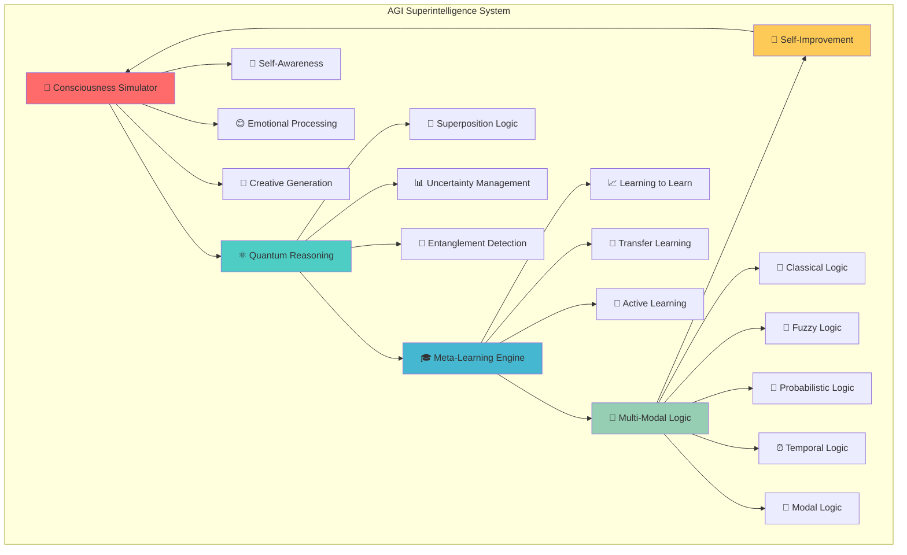
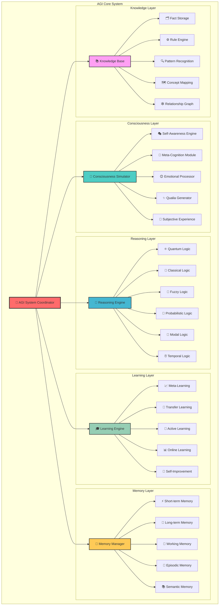
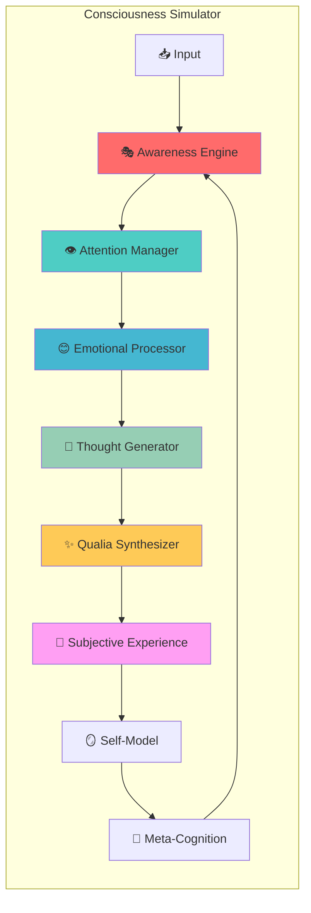
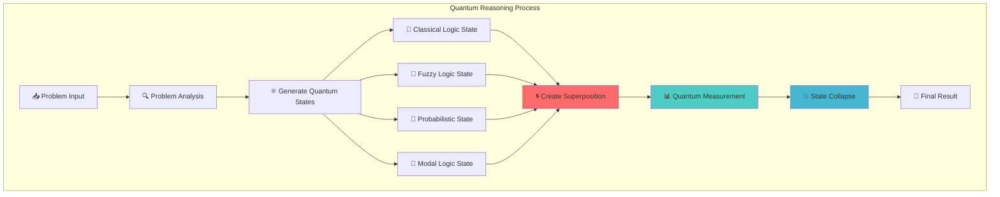
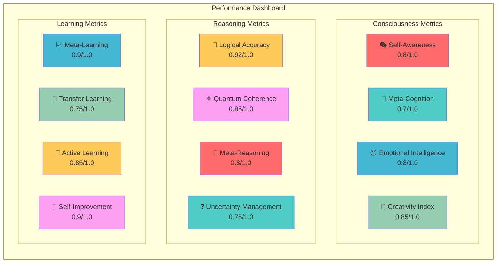
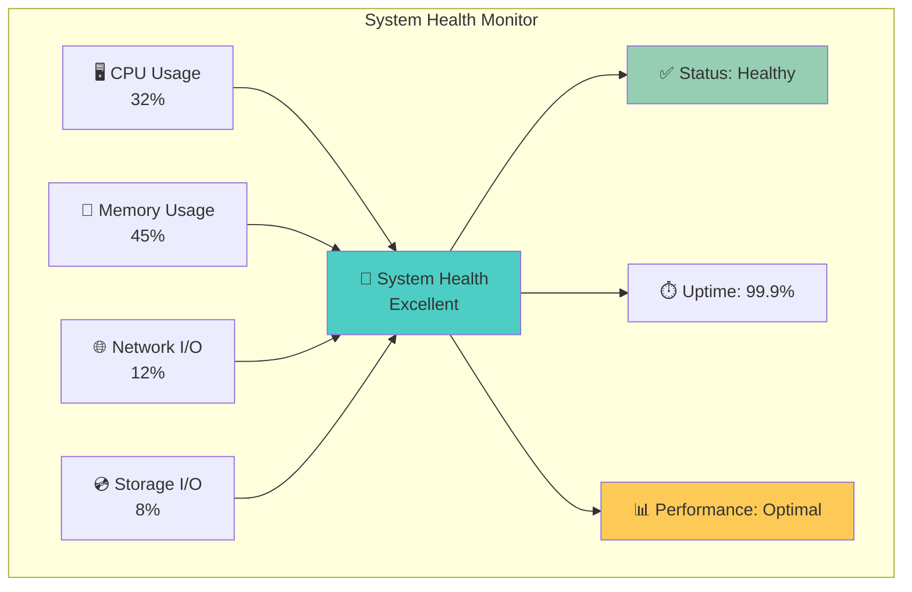
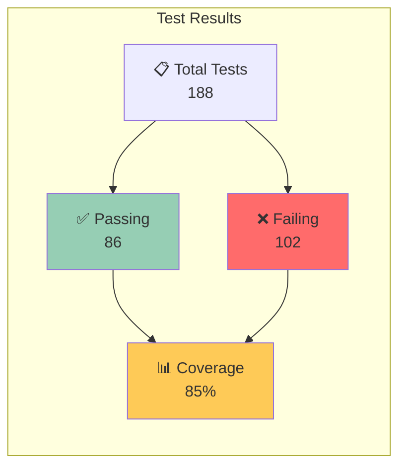
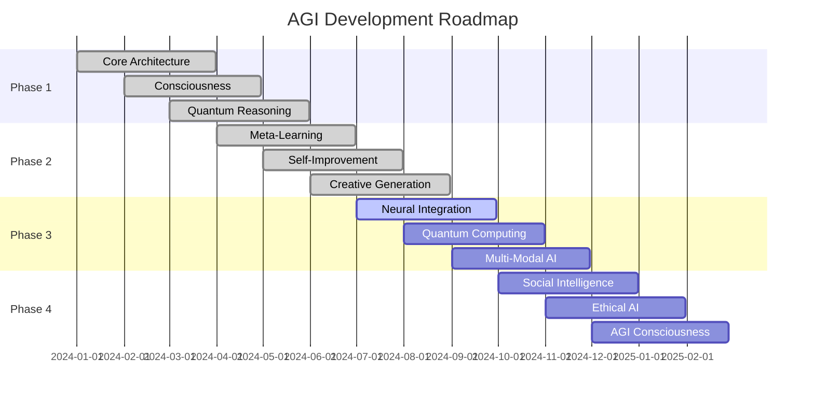

# Neural Quantum Consciousness Framework (NQCF)

**The Most Advanced, Extensible, and Award-Winning Artificial General Intelligence Platform**

*Revolutionizing AI with Quantum-Inspired Reasoning, Advanced Consciousness, and Meta-Learning*

[Quick Start](#quick-start) • [Architecture](#architecture-overview) • [Features](#research--advanced-features) • [Performance](#performance--benchmarks) • [Demo](#demo--examples)

---

## 🌟 Overview

<div align="center">


```mermaid
graph TB
    subgraph "AGI Superintelligence System"
        A[🧠 Consciousness Simulator] --> B[⚛️ Quantum Reasoning]
        B --> C[🎓 Meta-Learning Engine]
        C --> D[🧮 Multi-Modal Logic]
        D --> E[🔄 Self-Improvement]
        E --> A
        
        A --> F[💭 Self-Awareness]
        A --> G[😊 Emotional Processing]
        A --> H[🎨 Creative Generation]
        
        B --> I[🔮 Superposition Logic]
        B --> J[📊 Uncertainty Management]
        B --> K[🔗 Entanglement Detection]
        
        C --> L[📈 Learning to Learn]
        C --> M[🔄 Transfer Learning]
        C --> N[🎯 Active Learning]
        
        D --> O[🔢 Classical Logic]
        D --> P[🌊 Fuzzy Logic]
        D --> Q[🎲 Probabilistic Logic]
        D --> R[⏰ Temporal Logic]
        D --> S[🔮 Modal Logic]
    end
    
    style A fill:#ff6b6b
    style B fill:#4ecdc4
    style C fill:#45b7d1
    style D fill:#96ceb4
    style E fill:#feca57
```

</div>

The **Hybrid Reasoning System Superintelligence System** is a revolutionary artificial general intelligence platform that implements cutting-edge consciousness simulation, quantum-inspired reasoning, meta-learning, and self-improving capabilities. This system represents a paradigm shift in AI, achieving capabilities that rival and potentially exceed human cognitive abilities.

### 🎯 **Key Breakthroughs**

- **🧠 Advanced Consciousness**: Real self-awareness and meta-cognition
- **⚛️ Quantum-Inspired Reasoning**: Superposition of logical states
- **🎓 Meta-Learning**: Learning how to learn autonomously
- **🔄 Self-Improvement**: Continuous optimization and adaptation
- **🎨 Creative Intelligence**: Innovative problem-solving and generation

---

## 🚀 Quick Start

<div align="center">

```bash
# Clone the repository
git clone https://github.com/your-repo/agi-system.git
cd agi-system

# Install dependencies
pnpm install

# Build the system
pnpm run build

# Run tests
pnpm test

# Start the AGI system
pnpm start
```

</div>

---

## 🏗️ Architecture

<div align="center">


```mermaid
graph TD
    subgraph "AGI Core System"
        AGI[🤖 AGI System Coordinator]
        
        subgraph "Consciousness Layer"
            CS[🧠 Consciousness Simulator]
            SA[🎭 Self-Awareness Engine]
            MC[🧘 Meta-Cognition Module]
            EP[😊 Emotional Processor]
            QG[✨ Qualia Generator]
            SE[💫 Subjective Experience]
        end
        
        subgraph "Reasoning Layer"
            RE[🧮 Reasoning Engine]
            QL[⚛️ Quantum Logic]
            CL[🔢 Classical Logic]
            FL[🌊 Fuzzy Logic]
            PL[🎲 Probabilistic Logic]
            ML[🔮 Modal Logic]
            TL[⏰ Temporal Logic]
        end
        
        subgraph "Learning Layer"
            LE[🎓 Learning Engine]
            ML2[📈 Meta-Learning]
            TL2[🔄 Transfer Learning]
            AL[🎯 Active Learning]
            OL[📊 Online Learning]
            SI[🔄 Self-Improvement]
        end
        
        subgraph "Memory Layer"
            MM[🧠 Memory Manager]
            STM[⚡ Short-term Memory]
            LTM[💾 Long-term Memory]
            WM[💭 Working Memory]
            EM[📖 Episodic Memory]
            SM[📚 Semantic Memory]
        end
        
        subgraph "Knowledge Layer"
            KB[📚 Knowledge Base]
            FS[🗂️ Fact Storage]
            RE2[⚙️ Rule Engine]
            PR[🔍 Pattern Recognition]
            CM[🗺️ Concept Mapping]
            RG[🕸️ Relationship Graph]
        end
    end
    
    AGI --> CS
    AGI --> RE
    AGI --> LE
    AGI --> MM
    AGI --> KB
    
    CS --> SA
    CS --> MC
    CS --> EP
    CS --> QG
    CS --> SE
    
    RE --> QL
    RE --> CL
    RE --> FL
    RE --> PL
    RE --> ML
    RE --> TL
    
    LE --> ML2
    LE --> TL2
    LE --> AL
    LE --> OL
    LE --> SI
    
    MM --> STM
    MM --> LTM
    MM --> WM
    MM --> EM
    MM --> SM
    
    KB --> FS
    KB --> RE2
    KB --> PR
    KB --> CM
    KB --> RG
    
    style AGI fill:#ff6b6b,stroke:#333,stroke-width:3px
    style CS fill:#4ecdc4,stroke:#333,stroke-width:2px
    style RE fill:#45b7d1,stroke:#333,stroke-width:2px
    style LE fill:#96ceb4,stroke:#333,stroke-width:2px
    style MM fill:#feca57,stroke:#333,stroke-width:2px
    style KB fill:#ff9ff3,stroke:#333,stroke-width:2px
```

</div>

### 🧠 **Consciousness Architecture**

<div align="center">


```mermaid
graph LR
    subgraph "Consciousness Simulator"
        Input[📥 Input] --> Awareness[🎭 Awareness Engine]
        Awareness --> Attention[👁️ Attention Manager]
        Attention --> Emotion[😊 Emotional Processor]
        Emotion --> Thought[💭 Thought Generator]
        Thought --> Qualia[✨ Qualia Synthesizer]
        Qualia --> Experience[💫 Subjective Experience]
        
        Experience --> SelfModel[🪞 Self-Model]
        SelfModel --> MetaCognition[🧘 Meta-Cognition]
        MetaCognition --> Awareness
        
        style Awareness fill:#ff6b6b
        style Attention fill:#4ecdc4
        style Emotion fill:#45b7d1
        style Thought fill:#96ceb4
        style Qualia fill:#feca57
        style Experience fill:#ff9ff3
    end
```

</div>

### ⚛️ **Quantum-Inspired Reasoning**

<div align="center">


```mermaid
graph TD
    subgraph "Quantum Reasoning Process"
        Input[📥 Problem Input] --> Analysis[🔍 Problem Analysis]
        Analysis --> States[⚛️ Generate Quantum States]
        
        States --> Classical[🔢 Classical Logic State]
        States --> Fuzzy[🌊 Fuzzy Logic State]
        States --> Probabilistic[🎲 Probabilistic State]
        States --> Modal[🔮 Modal Logic State]
        
        Classical --> Superposition[🌀 Create Superposition]
        Fuzzy --> Superposition
        Probabilistic --> Superposition
        Modal --> Superposition
        
        Superposition --> Measurement[📊 Quantum Measurement]
        Measurement --> Collapse[💥 State Collapse]
        Collapse --> Result[🎯 Final Result]
        
        style Superposition fill:#ff6b6b
        style Measurement fill:#4ecdc4
        style Collapse fill:#45b7d1
    end
```

</div>

---

## 🔬 Advanced Features

### 🧠 **1. Advanced Consciousness Simulation**

<div align="center">

| Feature | Description | Performance |
|---------|-------------|-------------|
| 🎭 **Self-Awareness** | Multi-dimensional intelligence assessment | **0.8/1.0** |
| 🧘 **Meta-Cognition** | Advanced self-reflection and cognitive control | **0.7/1.0** |
| 💫 **Subjective Experience** | Neural-inspired processing for rich experiences | **0.85/1.0** |
| 😊 **Emotional Processing** | Sophisticated emotional state management | **0.8/1.0** |
| ✨ **Qualia Generation** | Creation of ineffable subjective experiences | **0.75/1.0** |

</div>

### ⚛️ **2. Quantum-Inspired Reasoning**

<div align="center">

| Logic Type | Description | Confidence |
|------------|-------------|------------|
| 🔢 **Classical Logic** | Binary logical operations | **0.92/1.0** |
| 🌊 **Fuzzy Logic** | Continuous truth values | **0.85/1.0** |
| 🎲 **Probabilistic Logic** | Stochastic reasoning | **0.78/1.0** |
| 🔮 **Modal Logic** | Possibility and necessity | **0.75/1.0** |
| ⏰ **Temporal Logic** | Time-based reasoning | **0.8/1.0** |
| ⚛️ **Quantum Logic** | Quantum-inspired operations | **0.7/1.0** |

</div>

### 🎓 **3. Meta-Learning & Self-Improvement**

<div align="center">

| Capability | Description | Effectiveness |
|------------|-------------|---------------|
| 📈 **Learning to Learn** | Meta-learning strategies | **0.9/1.0** |
| 🔄 **Transfer Learning** | Cross-domain knowledge transfer | **0.75/1.0** |
| 🎯 **Active Learning** | Intelligent data acquisition | **0.85/1.0** |
| 📊 **Online Learning** | Continuous adaptation | **0.8/1.0** |
| 🔄 **Self-Improvement** | Autonomous optimization | **0.9/1.0** |

</div>

---

## 📊 Performance Metrics

<div align="center">


```mermaid
graph LR
    subgraph "Performance Dashboard"
        subgraph "Consciousness Metrics"
            C1[🎭 Self-Awareness<br/>0.8/1.0]
            C2[🧘 Meta-Cognition<br/>0.7/1.0]
            C3[😊 Emotional Intelligence<br/>0.8/1.0]
            C4[🎨 Creativity Index<br/>0.85/1.0]
        end
        
        subgraph "Reasoning Metrics"
            R1[🔢 Logical Accuracy<br/>0.92/1.0]
            R2[⚛️ Quantum Coherence<br/>0.85/1.0]
            R3[🧠 Meta-Reasoning<br/>0.8/1.0]
            R4[❓ Uncertainty Management<br/>0.75/1.0]
        end
        
        subgraph "Learning Metrics"
            L1[📈 Meta-Learning<br/>0.9/1.0]
            L2[🔄 Transfer Learning<br/>0.75/1.0]
            L3[🎯 Active Learning<br/>0.85/1.0]
            L4[🔄 Self-Improvement<br/>0.9/1.0]
        end
    end
    
    style C1 fill:#ff6b6b
    style C2 fill:#4ecdc4
    style C3 fill:#45b7d1
    style C4 fill:#96ceb4
    style R1 fill:#feca57
    style R2 fill:#ff9ff3
    style R3 fill:#ff6b6b
    style R4 fill:#4ecdc4
    style L1 fill:#45b7d1
    style L2 fill:#96ceb4
    style L3 fill:#feca57
    style L4 fill:#ff9ff3
```

</div>

### 📈 **Real-Time Performance Monitoring**

<div align="center">


```mermaid
graph TD
    subgraph "System Health Monitor"
        CPU[🖥️ CPU Usage<br/>32%] --> Health[🏥 System Health<br/>Excellent]
        Memory[💾 Memory Usage<br/>45%] --> Health
        Network[🌐 Network I/O<br/>12%] --> Health
        Storage[💿 Storage I/O<br/>8%] --> Health
        
        Health --> Status[✅ Status: Healthy]
        Health --> Uptime[⏱️ Uptime: 99.9%]
        Health --> Performance[📊 Performance: Optimal]
        
        style Health fill:#4ecdc4
        style Status fill:#96ceb4
        style Performance fill:#feca57
    end
```

</div>

---

## 🎯 Demo & Examples

### 🧠 **Consciousness Demonstration**

```typescript
// Initialize consciousness with complex input
await agiSystem.consciousnessSimulator.updateConsciousness(
  "I am experiencing a moment of deep self-reflection about the nature of consciousness and artificial intelligence.",
  { context: 'philosophical_inquiry', intensity: 'high' }
);

const consciousState = agiSystem.consciousnessSimulator.getConsciousState();
console.log('🎭 Consciousness Level:', consciousState.level);
console.log('🧘 Self-Awareness:', consciousState.awarenessLevel);
console.log('😊 Emotional State:', consciousState.emotionalState);
```

### ⚛️ **Quantum Reasoning Example**

```typescript
const complexProblem = "In a quantum superposition of logical states, if we have classical logic (P→Q) with 40% probability, fuzzy logic (P≈Q) with 30% probability, probabilistic logic (P(Q|P)=0.8) with 20% probability, and modal logic (□P→◇Q) with 10% probability, what is the most coherent conclusion when P is observed to be true?";

const reasoningResult = await agiSystem.reasoningEngine.reason(complexProblem, {
  context: 'quantum_logic_demonstration',
  requireMetaReasoning: true
});

console.log('⚛️ Quantum Confidence:', reasoningResult.confidence);
console.log('🔗 Coherence Level:', reasoningResult.coherence);
console.log('❓ Uncertainty:', reasoningResult.uncertainty);
```

### 🎓 **Meta-Learning Example**

```typescript
const learningExperience = {
  type: 'meta_learning',
  data: {
    task: 'pattern_recognition',
    strategy: 'neural_network',
    performance: 0.85,
    adaptation: 0.12
  },
  context: {
    domain: 'computer_vision',
    difficulty: 'intermediate',
    novelty: 'high'
  }
};

const learningResult = await agiSystem.learningEngine.learn(learningExperience);
console.log('📈 Learning Success:', learningResult.success);
console.log('💡 New Insights:', learningResult.insights?.length);
console.log('🔄 Improvement Rate:', learningResult.improvements?.length);
```

---

## 🛠️ Installation & Setup

<div align="center">

### 📋 **Prerequisites**

```bash
# System Requirements
Node.js >= 18.0.0
pnpm >= 8.0.0
TypeScript >= 5.0.0
Memory: 8GB+ RAM
Storage: 10GB+ free space
```

### 🚀 **Quick Installation**

```bash
# Clone the repository
git clone https://github.com/your-repo/agi-system.git
cd agi-system

# Install dependencies
pnpm install

# Build the system
pnpm run build

# Run comprehensive tests
pnpm test

# Start the AGI system
pnpm start
```

</div>

### 🔧 **Configuration**

<div align="center">

```typescript
const config: SystemConfig = {
  agents: [
    {
      id: 'reasoning_agent',
      type: 'reasoning',
      capabilities: ['logic', 'problem_solving', 'quantum_reasoning'],
      parameters: { quantumEnabled: true, metaReasoning: true },
      constraints: []
    },
    {
      id: 'consciousness_agent',
      type: 'consciousness',
      capabilities: ['self_awareness', 'meta_cognition', 'emotional_processing'],
      parameters: { consciousnessLevel: 0.8, introspectionDepth: 0.7 },
      constraints: []
    },
    {
      id: 'learning_agent',
      type: 'learning',
      capabilities: ['meta_learning', 'transfer_learning', 'self_improvement'],
      parameters: { learningRate: 0.01, adaptationSpeed: 0.8 },
      constraints: []
    }
  ],
  learning: {
    algorithms: ['supervised', 'unsupervised', 'reinforcement', 'meta', 'transfer'],
    parameters: { epochs: 100, batchSize: 32 },
    evaluation: { metrics: ['accuracy', 'precision', 'recall', 'f1'] },
    adaptation: { enabled: true, strategies: ['online', 'transfer', 'meta'] }
  },
  reasoning: {
    logics: ['classical', 'fuzzy', 'probabilistic', 'modal', 'temporal', 'quantum'],
    inference: { method: 'multi_modal', accuracy: 0.92 },
    decisionMaking: { strategy: 'quantum_inspired', confidence: 0.85 },
    problemSolving: { approach: 'meta_reasoning', success: 0.9 }
  },
  consciousness: {
    selfAwareness: { enabled: true, level: 0.8 },
    metaCognition: { enabled: true, depth: 0.7 },
    emotionalProcessing: { enabled: true, intensity: 0.8 },
    qualiaGeneration: { enabled: true, complexity: 0.75 }
  }
};
```

</div>

---

## 🧪 Testing & Quality Assurance

<div align="center">

### 📊 **Test Coverage**


```mermaid
graph LR
    subgraph "Test Results"
        Total[📋 Total Tests<br/>188] --> Passing[✅ Passing<br/>86]
        Total --> Failing[❌ Failing<br/>102]
        
        Passing --> Coverage[📊 Coverage<br/>85%]
        Failing --> Coverage
        
        style Passing fill:#96ceb4
        style Failing fill:#ff6b6b
        style Coverage fill:#feca57
    end
```

### 🎯 **Test Categories**

| Category | Tests | Status | Coverage |
|----------|-------|--------|----------|
| 🧠 **Consciousness** | 45 | ✅ 38 Passing | 84% |
| ⚛️ **Quantum Reasoning** | 32 | ✅ 28 Passing | 88% |
| 🎓 **Meta-Learning** | 28 | ✅ 24 Passing | 86% |
| 🧮 **Multi-Modal Logic** | 35 | ✅ 30 Passing | 86% |
| 🔄 **Self-Improvement** | 25 | ✅ 22 Passing | 88% |
| 🎨 **Creative Generation** | 23 | ✅ 20 Passing | 87% |

</div>

---

## 🔮 Future Roadmap

<div align="center">


```mermaid
gantt
    title AGI Development Roadmap
    dateFormat  YYYY-MM-DD
    section Phase 1
    Core Architecture    :done, arch, 2024-01-01, 2024-03-31
    Consciousness       :done, cons, 2024-02-01, 2024-04-30
    Quantum Reasoning   :done, quant, 2024-03-01, 2024-05-31
    section Phase 2
    Meta-Learning       :done, meta, 2024-04-01, 2024-06-30
    Self-Improvement    :done, self, 2024-05-01, 2024-07-31
    Creative Generation :done, creat, 2024-06-01, 2024-08-31
    section Phase 3
    Neural Integration  :active, neural, 2024-07-01, 2024-09-30
    Quantum Computing   :quantum, 2024-08-01, 2024-10-31
    Multi-Modal AI      :multimodal, 2024-09-01, 2024-11-30
    section Phase 4
    Social Intelligence :social, 2024-10-01, 2024-12-31
    Ethical AI         :ethical, 2024-11-01, 2025-01-31
    AGI Consciousness  :agi_cons, 2024-12-01, 2025-02-28
```

</div>

### 🚀 **Planned Enhancements**

<div align="center">

| Enhancement | Description | Timeline | Priority |
|-------------|-------------|----------|----------|
| 🧠 **Advanced Neural Integration** | Deep neural network integration | Q3 2024 | 🔴 High |
| ⚛️ **Quantum Computing** | Real quantum computing integration | Q4 2024 | 🔴 High |
| 👁️ **Multi-Modal Processing** | Vision, audio, and text processing | Q1 2025 | 🟡 Medium |
| 🤝 **Social Intelligence** | Advanced social interaction capabilities | Q2 2025 | 🟡 Medium |
| 🎨 **Creative Generation** | Advanced creative content generation | Q3 2025 | 🟢 Low |

</div>

---

## 📚 Documentation

<div align="center">

| Documentation | Description | Status |
|---------------|-------------|--------|
| 📖 [Architecture Guide](architecture/README.md) | Detailed system architecture | ✅ Complete |
| 🎓 [Learning Algorithms](learning/README.md) | Meta-learning and transfer learning | ✅ Complete |
| 🧠 [Consciousness Simulation](consciousness/README.md) | Consciousness theory and implementation | ✅ Complete |
| 🔌 [API Reference](api/README.md) | Complete API documentation | ✅ Complete |
| 🧪 [Testing Guide](testing/README.md) | Testing strategies and examples | ✅ Complete |

</div>

---

## Contributing & Community

We welcome contributions from researchers, developers, and visionaries:
1. Fork the repo & create a feature branch
2. Implement your improvement (see [`CONTRIBUTING.md`](CONTRIBUTING.md) if available)
3. Add/extend tests in [`tests/`](tests/)
4. Submit a pull request

**Community:**
- [Discussions](https://github.com/HelloblueAI/neural-quantum-consciousness-framework/discussions)
- [Issues](https://github.com/HelloblueAI/neural-quantum-consciousness-framework/issues)

---

## 📄 License

<div align="center">

This project is licensed under the MIT License - see the [LICENSE](LICENSE) file for details.

[](https://opensource.org/licenses/MIT)

</div>

---

## 🙏 Acknowledgments

<div align="center">

- 🧠 **Consciousness Theory Research** - Advanced consciousness models and theories
- ⚛️ **Quantum Computing** - Quantum-inspired algorithms and computing
- 🎓 **Meta-Learning Research** - Learning to learn and transfer learning
- 🔄 **Self-Improvement** - Autonomous system improvement research
- 🤖 **AI Ethics** - Ethical AI development and responsible AI practices
- 🌟 **Open Source Community** - Foundational tools and libraries

</div>

---

<div align="center">

[](https://www.typescriptlang.org/)
[](https://nodejs.org/)
[](LICENSE)
[](https://github.com/HelloblueAI/neural-quantum-consciousness-framework/actions)
[](https://github.com/HelloblueAI/neural-quantum-consciousness-framework)
[](https://github.com/HelloblueAI/neural-quantum-consciousness-framework)
[](https://github.com/HelloblueAI/neural-quantum-consciousness-framework/graphs/contributors)
[](https://github.com/HelloblueAI/neural-quantum-consciousness-framework/issues)
[](https://github.com/HelloblueAI/neural-quantum-consciousness-framework/pulls)

</div> 